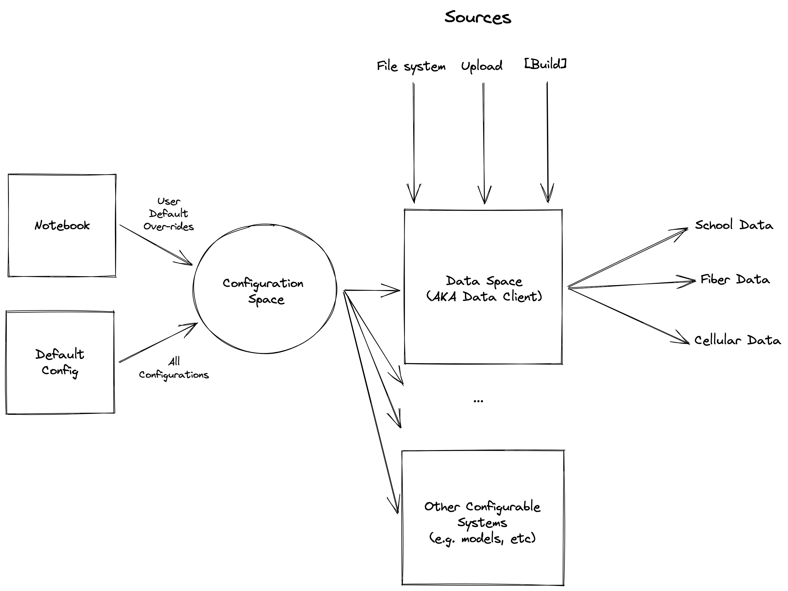
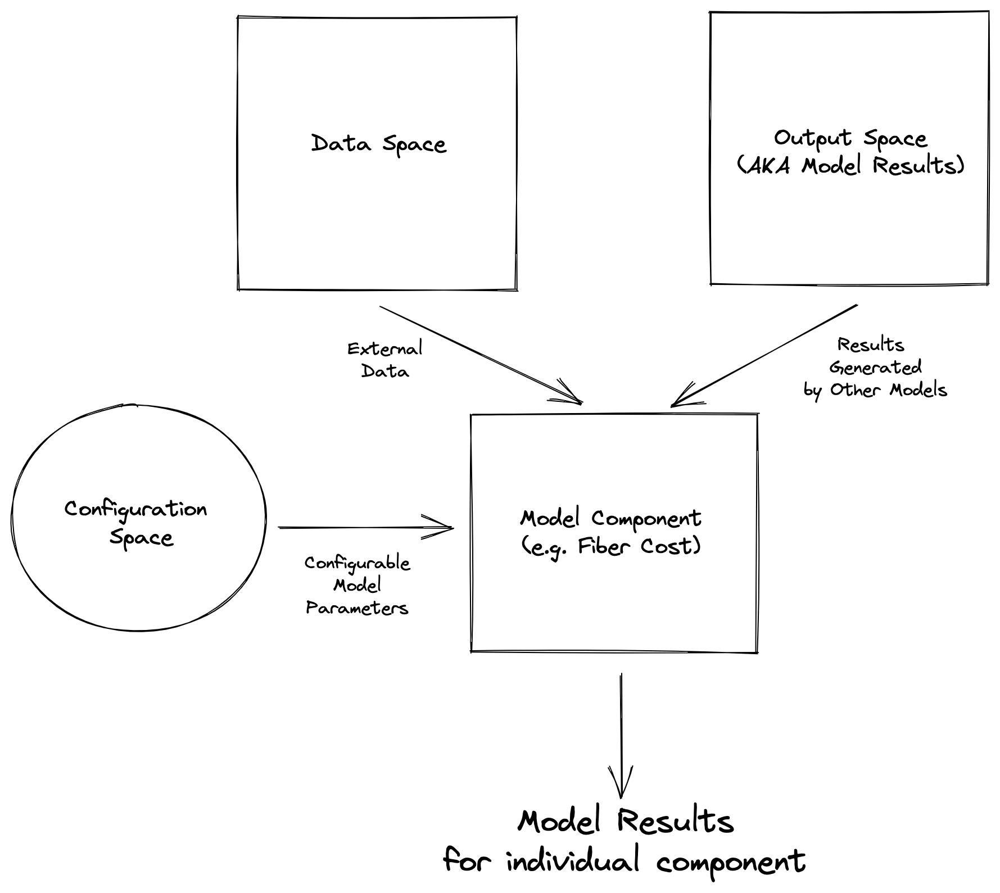
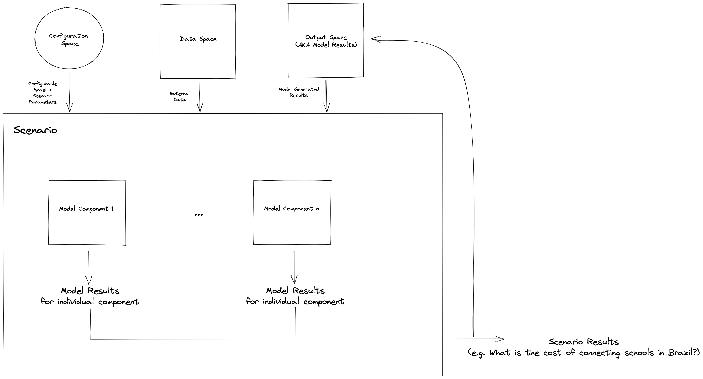

# Model Library Architecture

This document provides an overview of the key parts of the library - namely those used for configuration, data aggregation, and modeling execution.

## Configuration

Let's first take a look at how the library is configured.
There are a number of challenges in managing all the potential configurations needed to drive a modeling application.
These configurations fall outside the scope of any deployment configurations that may be necessary to run the application in a cloud environment.
Instead these configurations aim to specify:
* data: where external data comes from, how it is managed, and how it can be used in the models
* models: parameters associated with model execution 
* scenario: what question is the end user of the model application trying to answer

First, let's take a look at how configuration works within the library.
There are two configurations modes for the application:
1. default mode - specifies all of the baseline parameters, including those that are used to aggregate data. The default configuration uses a sample data set to drive the models.
2. user input mode - allows users to over-ride defaults through an interactive interface

The configuration process is outlined in the diagram below.

Configuration space, which contains all the parameters necessary to run the models can be jointly configured with the default configurations and through the notebook interface by model application users.
The diagram additionally outlines how the configuration space is used to configured the data client in the application (called the Data Space).
The data space provides all the external data necessary to run the models such as school data, fiber data, and cellular data.

## Models

All modeling capabilities are defined within `giga/models`. The models are further broken down into the following categories:

* Nodes: atomic, modular building blocks that contain a computation, transformation, or serve external data
* Components: stacks nodes together with a clear and specific purpose (e.g. use case driven - compute cost of fiber connection) prepares the models to join into the entities that solve a specific problem
* Scenarios: drives the computation by piecing together multiple components and solving a specific problem by deriving a key result. Allows same components to serve multiple purposes: e.g. answer the questions of what is the cost of connecting all schools in Rwanda to the internet? VS If there is a budget of $10M which schools should be connected to maximize the number of students with internet access?

Model components are standardized in their interfaces and instantiation - a configuration space is needed to initialize a model component.
While data and output spaces are needed to run a component.
A model component example is outlined in the diagram below.

The execution of model components is managed by the scenario, which aims to use the model components to solve a specific user problem.
A diagram of how scenarios use components is shown below.

A scenario manages how model components are orchestrated (e.g. order, dependencies, etc), and manages the outputs of individual components.