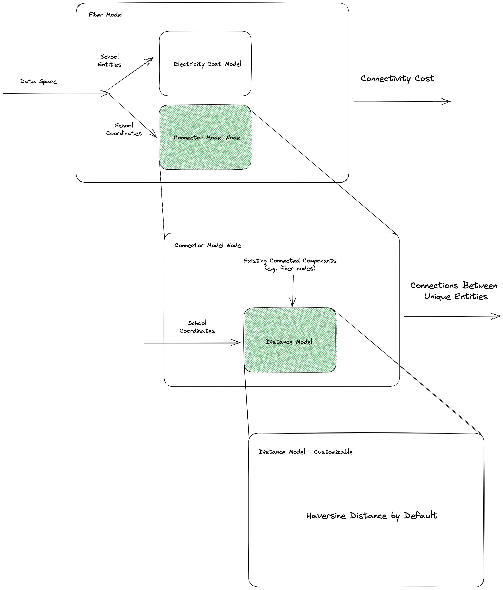

# Model Documentation

Key model components are outlined below.
Their architecture is presented in diagram format and code snippet examples are shown as well.
As a reminder a model component is differentiated from a model node in the following way:

* Nodes: atomic, modular building blocks that contain a computation, transformation, or serve external data
* Components: stacks nodes together with a clear and specific purpose (e.g. use case driven - compute cost of fiber connection) prepares the models to join into the entities that solve a specific problem
* Scenarios: drives the computation by piecing together multiple components and solving a specific problem by deriving a key result. Allows same components to serve multiple purposes: e.g. answer the questions of what is the cost of connecting all schools in Rwanda to the internet? VS If there is a budget of $10M which schools should be connected to maximize the number of students with internet access?

## Fiber Cost Model

Documentation of the fiber cost model can be found below.

* **Description**: estimates the CapEx and annual OpEx costs of connecting a school to the internet using fiber.
Considers economies of scale by default which assumes schools that have been connected to a fiber network can be used as fiber nodes for unconnected schools.  
* **Sub-models**:
	* Distance model: computes distances between point pairs (default is Haversine distance)
	* Connection model: connects a set of unconnected components (e.g. schools) to connected components (e.g. fiber nodes). Default is a greedy connect model that connects closest unconnected components to one that is connected. The default configuration assumes that unconnected components can can also be used as connections after they've been connected. This enables the economies of scale heuristic.
* **Parameters**: the full configuration set for the fiber models can be found [here](#fiber-model-configuration), the parameters exposed to users can be found below:
	* `Annual cost per Mbps (USD)`: the annual cost of connectivity per Mbps in US Dollars
    * `Cost Per km (USD)` is the average cost of laying fiber lines per km in US Dollars
    * `Maintenance Cost per km (USD)` is the expected annual maintenace cost of new fiber lines in US Dollars
    * `Maximum Connection Length (km)` is the maximum length of an individual fiber connection, if a single fiber connection exceeds this length, it will not be considered feasible
    * `Annual Power Required (kWh)` is the annual power in kWh needed to operate the equipment
    * `Economies of Scale` indicates if an economies of scale approach should be used when estimating the needed length of fiber lines
* **Data Inputs**: the typically external data needed to drive the models are outlined below. Please note that data inputs are accessible to model components through the `DataSpace` client.
	* Fiber node locations, as lat/lon coordinates, definition can be found [here](#unique-coordinate)
	* School entities, which includes coordinates and other properties, definition can be found [here](#school-entity)
* **Outputs**: the fiber generates a collection of connection costs for each school considered. The connection costs contain both CapEx and OpEx estimates. The definition for a single school cost can be found [here](#school-connection-cost)


### Architecture

The fiber model consists of the following sub-models:

* Distance model node for computing distances between two points. A custom implementation can be used instead of the default Haversine distance model.
* Connector model node used to identify feasible connections between points. A greedy distance connector model is the default. It connects unconnected components (e.g. schools) to connected components (e.g. fiber nodes) by picking the closest components first, where closest is determined by the distance model node.
* Electricity model component for estimating the electricity costs associated with installing and operating the internet technology.

The outline of the fiber model component architecture is shown in the diagram below.
The green shaded boxes indicate models for which a custom node could be implemented with a different capability.
For example, the default distance metric used in estimating fiber costs is Haversine, if a distance metric along known roads was desired, a new node implementation that calculates that distance between two points can be substituted to derive a different set of results.

  

### Implementation Example

For an in-depth model "driver" that provides an in-depth overview of how the fiber model works, see the notebook [here](../notebooks/fiber-model.ipynb).
The example below shows how a custom distance model can be used in a fiber model component.
Please note that the custom model below `RoadLengthDistance` is not currently part of the library and is simply an example.

```python
from giga.models.components.fiber_cost_model import FiberCostModel
from giga.schemas.conf.models import FiberTechnologyCostConf

# Specify all the configurations, there are parsers that can help with this in the library
config = FiberTechnologyCostConf(
            capex={
                "cost_per_km": 7_500, # USD
                "economies_of_scale": True,
            },
            opex={
                "cost_per_km": 100, # USD
                "annual_bandwidth_cost_per_mbps": 10, # in USD
            },
            constraints={
                "maximum_connection_length": 20, # km
                "required_power": 500, # in kWh
                "maximum_bandwithd": 2_000.0, # mbps
            },
        )

# Use a custom implementation for distance model (this is an example)
custom_distance_model = RoadLengthDistance() # Note this is an example, must expose a `run` method

# Get the school data
schools = ... # a number of ways to load this including from project connect APIs

# create and run the mode
model = FiberCostModel(config)
outputs = model.run(schools,
                    distance_model=custom_distance_model) # pass in the model at runtime
```


## Implementing a Model

You can implement a new technology by adding a new model component.
You can find the notebook [here](../notebooks/drivers/model-component-example.ipynb) that walks through the details of the implementation.
In order to fully integrate a new model component into the notebook application, you'll need to complete the following additional steps:
1. Extend the data schemas for technology definitions and scenarios to include the new technology model  
2. Extend the scenario implementation you would like this technology to be available in
3. Update the notebook UI to include the configurable cost drivers of this scenario 


## Data Schemas

The schemas below define key data types used in the modeling library.
The definitions are roughly broken down into three categories: model configuration, input data definitions, and output data definitions.

### Unique Coordinate

```json
{
    "title": "UniqueCoordinate",
    "description": "Uniquely identifiable lat/lon coordinate",
    "type": "object",
    "properties": {
        "coordinate_id": {
            "title": "Coordinate Id",
            "type": "string"
        },
        "coordinate": {
            "title": "Coordinate",
            "type": "array",
            "minItems": 2,
            "maxItems": 2,
            "items": [
                {
                    "type": "number"
                },
                {
                    "type": "number"
                }
            ]
        },
        "properties": {
            "title": "Properties",
            "type": "object"
        }
    },
    "required": [
        "coordinate_id",
        "coordinate"
    ]
}
```

### School Entity

```json
{
    "title": "GigaSchool",
    "description": "Definition of a single school",
    "type": "object",
    "properties": {
        "school_id": {
            "title": "School Id",
            "type": "string"
        },
        "name": {
            "title": "Name",
            "type": "string"
        },
        "country": {
            "title": "Country",
            "type": "string"
        },
        "country_id": {
            "title": "Country Id",
            "type": "integer"
        },
        "lat": {
            "title": "Lat",
            "type": "number"
        },
        "lon": {
            "title": "Lon",
            "type": "number"
        },
        "admin_1_name": {
            "title": "Admin 1 Name",
            "type": "string"
        },
        "admin_2_name": {
            "title": "Admin 2 Name",
            "type": "string"
        },
        "admin_3_name": {
            "title": "Admin 3 Name",
            "type": "string"
        },
        "admin_4_name": {
            "title": "Admin 4 Name",
            "type": "string"
        },
        "education_level": {
            "$ref": "#/definitions/EducationLevel"
        },
        "giga_id_school": {
            "title": "Giga Id School",
            "type": "string"
        },
        "environment": {
            "$ref": "#/definitions/SchoolZone"
        },
        "connected": {
            "title": "Connected",
            "default": false,
            "type": "boolean"
        },
        "has_electricity": {
            "title": "Has Electricity",
            "default": true,
            "type": "boolean"
        },
        "bandwidth_demand": {
            "title": "Bandwidth Demand",
            "default": 20.0,
            "type": "number"
        }
    },
    "required": [
        "school_id",
        "name",
        "country",
        "country_id",
        "lat",
        "lon",
        "admin_1_name",
        "admin_2_name",
        "admin_3_name",
        "admin_4_name",
        "education_level",
        "giga_id_school",
        "environment"
    ],
    "definitions": {
        "EducationLevel": {
            "title": "EducationLevel",
            "description": "Valid level of education",
            "enum": [
                "Primary",
                "Secondary",
                "Other",
                ""
            ],
            "type": "string"
        },
        "SchoolZone": {
            "title": "SchoolZone",
            "description": "Valid school zone environment",
            "enum": [
                "rural",
                "urban",
                ""
            ],
            "type": "string"
        }
    }
}
```

### Fiber Model Configuration

```json
{
    "title": "FiberTechnologyCostConf",
    "type": "object",
    "properties": {
        "capex": {
            "$ref": "#/definitions/FiberCapex"
        },
        "opex": {
            "$ref": "#/definitions/FiberOpex"
        },
        "constraints": {
            "$ref": "#/definitions/FiberConstraints"
        },
        "technology": {
            "title": "Technology",
            "default": "Fiber",
            "type": "string"
        },
        "electricity_config": {
            "$ref": "#/definitions/ElectricityCostConf"
        }
    },
    "required": [
        "capex",
        "opex",
        "constraints"
    ],
    "definitions": {
        "FiberCapex": {
            "title": "FiberCapex",
            "type": "object",
            "properties": {
                "cost_per_km": {
                    "title": "Cost Per Km",
                    "type": "number"
                },
                "fixed_costs": {
                    "title": "Fixed Costs",
                    "default": 0.0,
                    "type": "number"
                },
                "economies_of_scale": {
                    "title": "Economies Of Scale",
                    "default": true,
                    "type": "boolean"
                }
            },
            "required": [
                "cost_per_km"
            ]
        },
        "FiberOpex": {
            "title": "FiberOpex",
            "type": "object",
            "properties": {
                "cost_per_km": {
                    "title": "Cost Per Km",
                    "type": "number"
                },
                "annual_bandwidth_cost_per_mbps": {
                    "title": "Annual Bandwidth Cost Per Mbps",
                    "default": 0.0,
                    "type": "number"
                }
            },
            "required": [
                "cost_per_km"
            ]
        },
        "FiberConstraints": {
            "title": "FiberConstraints",
            "type": "object",
            "properties": {
                "maximum_connection_length": {
                    "title": "Maximum Connection Length",
                    "default": Infinity,
                    "type": "number"
                },
                "maximum_bandwithd": {
                    "title": "Maximum Bandwithd",
                    "default": 2000,
                    "type": "number"
                },
                "required_power": {
                    "title": "Required Power",
                    "default": 500,
                    "type": "number"
                }
            }
        },
        "ElectricityCapexConf": {
            "title": "ElectricityCapexConf",
            "type": "object",
            "properties": {
                "solar_panel_costs": {
                    "title": "Solar Panel Costs",
                    "type": "number"
                },
                "battery_costs": {
                    "title": "Battery Costs",
                    "type": "number"
                }
            },
            "required": [
                "solar_panel_costs",
                "battery_costs"
            ]
        },
        "ElectricityOpexConf": {
            "title": "ElectricityOpexConf",
            "type": "object",
            "properties": {
                "cost_per_kwh": {
                    "title": "Cost Per Kwh",
                    "type": "number"
                }
            },
            "required": [
                "cost_per_kwh"
            ]
        },
        "ElectricityCostConf": {
            "title": "ElectricityCostConf",
            "type": "object",
            "properties": {
                "capex": {
                    "$ref": "#/definitions/ElectricityCapexConf"
                },
                "opex": {
                    "$ref": "#/definitions/ElectricityOpexConf"
                }
            },
            "required": [
                "capex",
                "opex"
            ]
        }
    }
}
```

### School Connection Cost

```json
{
    "title": "SchoolConnectionCosts",
    "type": "object",
    "properties": {
        "school_id": {
            "title": "School Id",
            "type": "string"
        },
        "capex": {
            "title": "Capex",
            "type": "number"
        },
        "opex": {
            "title": "Opex",
            "type": "number"
        },
        "opex_provider": {
            "title": "Opex Provider",
            "type": "number"
        },
        "opex_consumer": {
            "title": "Opex Consumer",
            "type": "number"
        },
        "technology": {
            "$ref": "#/definitions/ConnectivityTechnology"
        },
        "feasible": {
            "title": "Feasible",
            "default": true,
            "type": "boolean"
        },
        "reason": {
            "title": "Reason",
            "type": "string"
        },
        "electricity": {
            "$ref": "#/definitions/PowerConnectionCosts"
        }
    },
    "required": [
        "school_id",
        "capex",
        "opex",
        "opex_provider",
        "opex_consumer",
        "technology"
    ],
    "definitions": {
        "ConnectivityTechnology": {
            "title": "ConnectivityTechnology",
            "description": "Technologies that can be assessed in modeling scenarios",
            "enum": [
                "Fiber",
                "Cellular",
                "Satellite",
                "None"
            ],
            "type": "string"
        },
        "PowerConnectionCosts": {
            "title": "PowerConnectionCosts",
            "type": "object",
            "properties": {
                "electricity_opex": {
                    "title": "Electricity Opex",
                    "default": 0.0,
                    "type": "number"
                },
                "electricity_capex": {
                    "title": "Electricity Capex",
                    "default": 0.0,
                    "type": "number"
                },
                "cost_type": {
                    "title": "Cost Type",
                    "default": "Grid",
                    "enum": [
                        "Grid",
                        "Solar"
                    ],
                    "type": "string"
                }
            }
        }
    }
}
```
